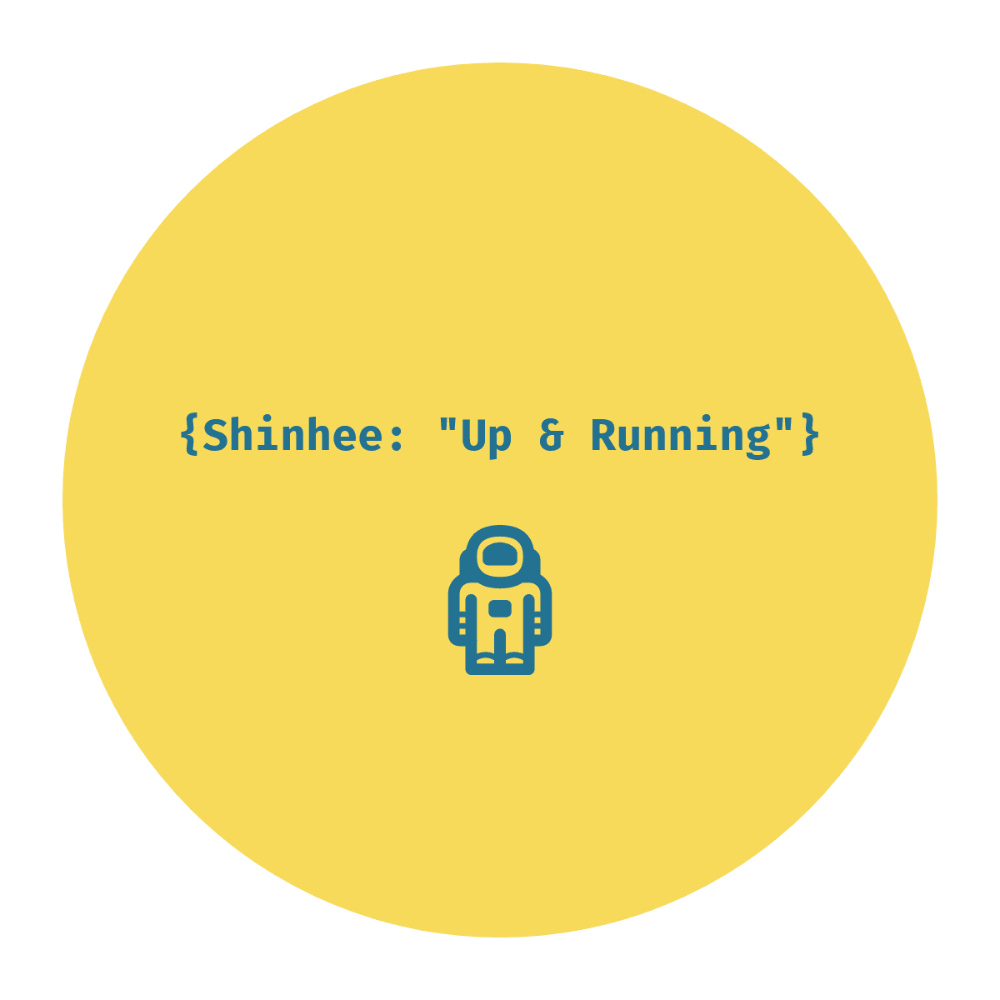
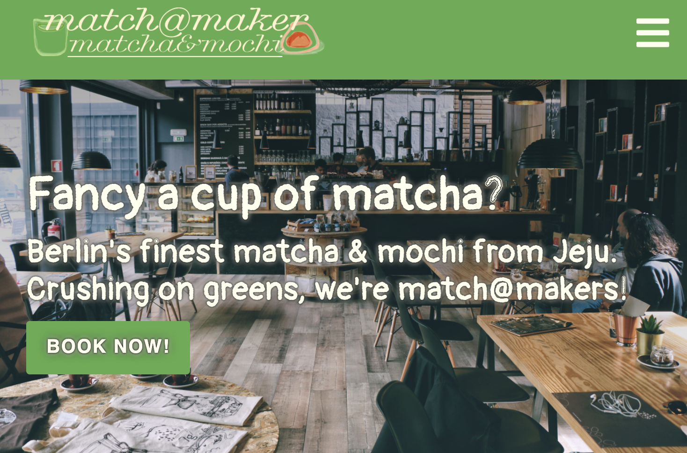
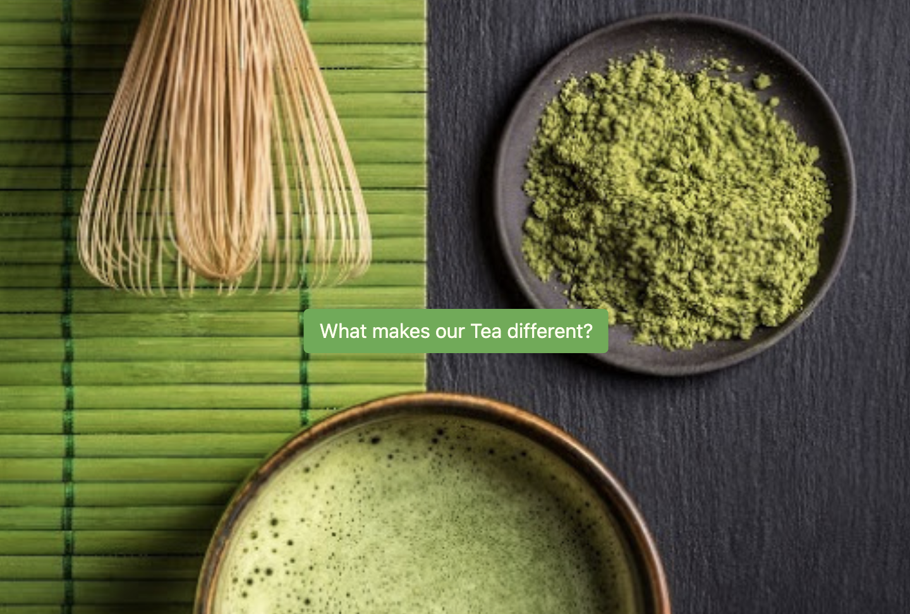
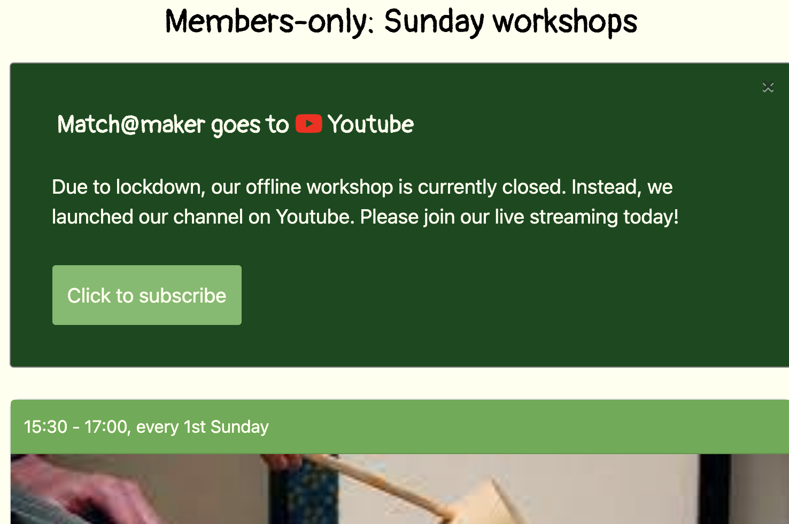

<!-- PROJECT LOGO -->
 

  

  <h3 align="center">Project_Matcha: Website Renewal</h3>

  

    Website Rebuilt for a Matcha Cafe in Berlin
     
    
    <a target="_blank" href="https://shinheechae.github.io/project_matcha/"><strong>App Link</strong></a>
      
    (deployed in Guithub Pages)
  

<!-- ABOUT THE PROJECT -->
## About The Project

- Single page website with a unified look
- Responsive contents & navbar
- Pragmatic & agile, amazing teamwork!👍

## Contact

Shinhee Chae - shinheechae@gmail.com
 
* [Project Link](https://github.com/shinheechae/project_matcha1)

## Acknowledgements

* [Old Website(before renewal)](https://shinheechae.github.io/matchamaker/)
* [GitHub Pages](https://pages.github.com)
* [hatchful](https://hatchful.shopify.com)

